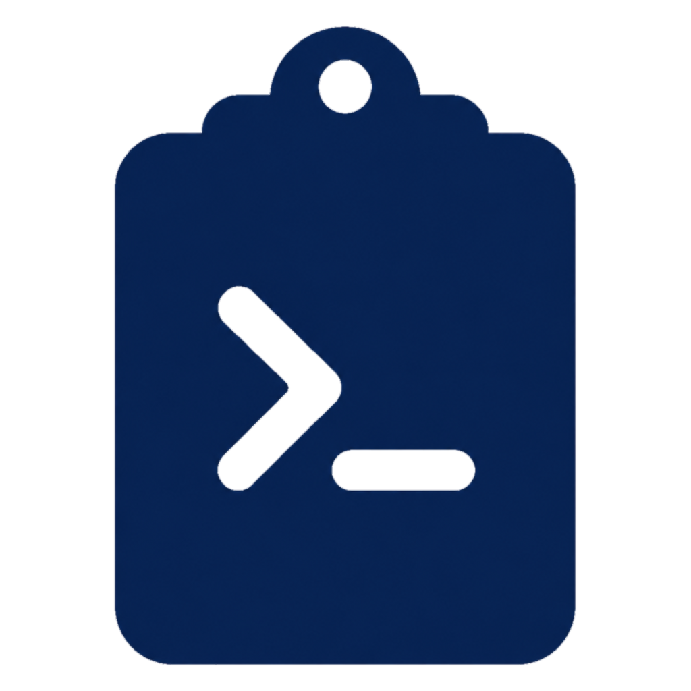

<div align="center">

# PastePilot



[](https://github.com/BeaCox/PastePilot/actions/workflows/ci.yml)

A local-first macOS clipboard manager that understands developer content.

PastePilot recognizes commands, JSON, code, errors, colors, screenshots, rich
text, and files, then suggests the next useful action from your menu bar. It
keeps high-fidelity pasteboard data when safe, supports searchable notes and
aliases, and includes local backup/restore. No telemetry, no cloud sync.
Everything stays on your Mac. Safe custom actions let you build reusable local
text and image-metadata templates without enabling shell execution.

[Download latest release](https://github.com/BeaCox/PastePilot/releases/latest) ·
[See demo](#demo) ·
[Build from source](#quick-start)

</div>

## Why PastePilot?

Most clipboard managers remember what you copied. PastePilot understands what
you copied and turns it into useful developer actions.

- **Clean commands before they hit your terminal.** Strip `$`, `%`, `❯`,
  virtualenv prompts, and terminal transcript noise.
- **Work with structured data faster.** Pretty-print JSON, minify it, or
  generate TypeScript interfaces from API responses.
- **Find screenshots by text.** OCR copied images locally with macOS Vision,
  then search clipboard history by visible text.
- **Organize history without changing the copied content.** Add titles, notes,
  and aliases that stay searchable and survive duplicate recapture.
- **Paste several fragments in one pass.** Queue up to 50 history items, choose
  the separator between them, and paste the stack into the active app in order.
- **Build your own safe transforms.** Create local template actions for text or
  image metadata using bounded placeholders and transforms—without running
  shell commands, accessing the network, or writing files.
- **Automate clipboard workflows.** Use Shortcuts to get, copy, delete, or
  transform history items without opening the PastePilot popover.
- **Handle sensitive workflows deliberately.** Pause capture, ignore the next
  copy, define custom sensitive patterns, or skip/redact sensitive matches
  before they are written to history.
- **Encrypt selected records.** Move text-based items into protected storage
  backed by a key in the macOS Keychain, with system authentication and an
  automatic lock timeout. Protected items lock as soon as they are moved;
  user titles, notes, and aliases remain visible so locked items stay identifiable.
- **Keep clipboard data local.** No plugins, no telemetry, and no cloud sync.

## Demo


## How It Compares

| Tool | Main focus | Where PastePilot differs |
|------|------------|--------------------------|
| **PastePilot** | Developer clipboard history with smart local actions | Recognizes commands, JSON, code, errors, colors, Markdown, rich text, images, and files; includes OCR search and sensitive-content masking |
| **Maccy** | Fast, minimal clipboard history | PastePilot adds content-aware transforms and developer workflows on top of clipboard history |
| **Raycast Clipboard** | Clipboard history inside a broader launcher | PastePilot is a standalone menu bar app focused on copied developer content and local-first behavior |
| **Paste / cloud clipboard apps** | Polished history, organization, and sync workflows | PastePilot prioritizes open source code, local storage, no telemetry, and no cloud dependency |

## Features

### Smart Content Recognition

PastePilot automatically identifies 11 content types and tailors actions to each:

| Type | Examples | Actions |
|------|----------|---------|
| **Command** | `$ npm install`, `git status`, `sudo apt install` | Strip prompt (`$` / `%` / `❯`), extract from terminal output, wrap in code block |
| **JSON** | API responses, config files | Format (pretty-print), minify, generate TypeScript interfaces |
| **URL** | `https://...` | Open in browser, copy |
| **Code** | Functions, snippets | Escape for string embedding, wrap in Markdown code block |
| **Error** | Stack traces, crash logs | Clean up for issues/chat, extract embedded commands |
| **Color** | `#FF5733`, `rgb(...)`, `hsl(...)` | Normalize hex format |
| **Markdown** | Headings, lists, links | Name conversion, string escape |
| **Rich Text** | Formatted text from web/editors | Preserve formatting, copy as plain text, copy HTML source |
| **Image** | Screenshots, copied images | Copy as image data, source URL, or file; copy Markdown with URL/path fallback; Quick Look, Show in Finder, OCR text and local QR/barcode extraction |
| **File** | Files from Finder | Copy, Quick Look, Show in Finder |
| **Plain Text** | Everything else | Convert to `camelCase` / `snake_case`, escape as string |

### Search and Organization

Search works across captured content, OCR text, source app metadata, file paths,
and your own titles, notes, and aliases. Use plain text, quoted phrases, or
filters:

| Query | Meaning |
|-------|---------|
| `kind:json` | JSON clipboard items |
| `app:Terminal` | Content copied from Terminal |
| `pinned:true` | Pinned items only |
| `has:ocr` | Images with recognized text |
| `has:title`, `has:note`, `has:alias` | Items with user metadata |
| `has:metadata`, `has:link` | Links with fetched metadata |
| `has:barcode`, `has:qr` | Images with locally detected codes |
| `"release notes"` | Exact phrase match |

Right-click any history item and choose **Edit Details…** to add a title, note,
or aliases. These fields are stored separately from captured content, indexed in
search, and kept when duplicate content is copied again and moved back to the
top.

### High-Fidelity Clipboard Replay

PastePilot stores selected original pasteboard representations with strict size
and type limits. When available, copying from history restores richer clipboard
data instead of only plain text:

- Rich text can preserve formatting and HTML source
- File groups can be copied back as files
- Images keep cached PNG data plus source URL or original path metadata
- Supported app-specific pasteboard formats can be replayed when safe

### Safe Custom Actions

Open **Preferences → Actions** to create reusable template actions. Each action
can be enabled or disabled and limited to text, images, or all supported content
types. Its rendered result appears alongside built-in actions and is copied to
the clipboard when selected.

Templates can use these local placeholders:

- `{{content}}`, `{{title}}`, `{{kind}}`, and `{{sourceApp}}`
- `{{ocr}}`, `{{imageURL}}`, and `{{imagePath}}` for image workflows
- `{{filePaths}}` and `{{newline}}` for lists and multi-line output

Append transforms such as `|uppercase`, `|lowercase`, `|trim`, `|urlencode`, or
`|jsonescape`. For example, `{{content|trim|uppercase}}` trims the selected
item and converts it to uppercase.

Custom actions are intentionally bounded and local. They cannot execute shell
commands, make network requests, or write files, and invalid or oversized
templates are ignored.

### Shortcuts Automation

PastePilot provides Shortcuts actions for getting the selected history item,
getting an item by one-based index, copying or deleting an item, clearing
unpinned history, and running any available built-in or enabled custom action.
The selected-item action uses the item most recently highlighted in the menu
bar, or the newest history item when no selection has been made.

### Command Intelligence

Built for the pain of copying `$ npm install` from a README and having to delete the `$` yourself:

- Recognizes 100+ command-line tools (`git`, `docker`, `kubectl`, `terraform`, `aws`, `brew`, ...)
- Strips prompt prefixes (`$`, `%`, `❯`, `➜`, `user@host$`, `(venv) $`)
- Extracts runnable commands from terminal transcripts mixed with output
- Handles multi-line commands with `\` continuation
- Parses commands inside fenced code blocks (` ```sh `, ` ```bash `, ` ```console `)

### Image Analysis

Copied images are automatically scanned for text using the macOS Vision framework. Recognized text is searchable in history — find a screenshot by typing any word visible in it. Supports Chinese (simplified/traditional), English, Japanese, and Korean.

PastePilot also uses Vision locally to extract QR codes and common barcodes.
Detected payloads are searchable, shown in the detail preview, and can be copied
with one action.

### Optional Link Metadata

Link title and description fetching is disabled by default. When explicitly
enabled in settings, newly copied HTTP(S) links are requested from their
destination and the resulting metadata becomes searchable. Credential-bearing
and non-web URLs are never requested.

### Paste as Plain Text

Press the configurable global shortcut (default: `⌥⇧⌘V`) to paste the current
clipboard text without fonts, colors, links, or other rich-text formatting.
PastePilot restores the original clipboard contents immediately afterward, so
images, files, and rich text remain available for normal pasting.

PastePilot can also paste immediately after copying a history item when
**Paste After Copying** is enabled and Accessibility permission is granted.

Both global shortcuts are managed together in General settings. Opening
PastePilot does not require Accessibility permission; pasting as plain text
does, because it sends a paste keystroke to the active app. Click **Request
Permission** to authorize it. Ad-hoc signed builds may need permission again
after an update, so close old DMGs and keep only the installed copy in
`/Applications`.

### Privacy & Security

- Detects and masks API keys, tokens, passwords, and private keys
- Supports custom sensitive-content patterns with literal or `regex:` rules
- Sensitive content hidden by default with optional reveal
- Sensitive content can be saved as original text, saved redacted, or skipped
  entirely from history
- Capture can be paused persistently, and **Ignore Next Copy** skips one
  clipboard change without reading it into history
- Clipboard data stays local and no telemetry is collected
- Custom actions only render bounded local templates; they cannot execute shell
  commands, access the network, or write files
- Selected text-based records can be encrypted with AES-GCM. The encryption key
  is stored in the macOS Keychain; protected clipboard content is omitted from
  SQLite search data, and unlocking requires system authentication. User titles,
  notes, and aliases are visible metadata and remain searchable while locked
- Protected records lock immediately when moved, after the configured unlock
  timeout, and when the Mac sleeps or the login session becomes inactive. Their
  encrypted backup data can only be opened on a Mac that has the matching
  PastePilot Keychain key
- Network access is limited to checking/downloading updates and optional, explicitly enabled link metadata requests
- History is stored in SQLite at `~/Library/Application Support/PastePilot/history.sqlite`
- Existing `history.json` and `history.backup.json` files are retained for migration and downgrade compatibility
- Copied images are stored as PNG files under `~/Library/Application Support/PastePilot/images/`
- Rich text, OCR results, locally detected barcode payloads, optional link metadata, source app metadata, and detected sensitive content may be persisted in history
- Titles, notes, aliases, and retained pasteboard representations may be
  persisted in history for search and high-fidelity replay
- Backup archives include the SQLite database, externalized text, and images
- The storage limit setting removes the oldest unpinned items when retained
  history exceeds the chosen local data size
- Sensitive-content masking only hides values in the UI; use the redacted or
  skipped storage policy if values should not be written to disk
- Clear history from PastePilot or delete its Application Support folder to remove stored clipboard data

### Menu Bar Interface

- **Hover preview** — pause on any item to see full content, source app, and metadata
- **Keyboard-driven** — search, navigation, previews, item actions, pinning,
  deletion, and cleanup all have keyboard paths
- **Search** — filter history by content, type, source app, pin state, OCR text,
  titles, notes, and aliases
- **Pin** — pinned items stay at the top and survive cleanup
- **Search filters** — a filter menu next to the search field inserts
  `kind:`, `pinned:`, and `has:` query tokens
- **Undo delete** — deleting an item shows an Undo toast for a few seconds
  before its data is actually removed
- **Paste stack** — queue multiple items, reorder them by dragging, and paste
  them into the active app in the selected order
- **Edit details** — add searchable titles, notes, and aliases from the context menu
- **Drag & drop** — drop files or images directly into the popover

#### Keyboard shortcuts

| Shortcut | Action |
|----------|--------|
| `↑` / `↓` | Move the selected history item |
| `↩` | Copy the selected item |
| `␣` | Open or close the selected item's preview |
| `⌘1`–`⌘9` | Copy the corresponding visible history item |
| `⌥1`–`⌥9` | Run an action for the selected item, matching the preview action list |
| `⌘P` | Pin or unpin the selected item |
| `⌘⌫` | Delete the selected item |
| `⌘⇧⌫` | Clear unpinned history after confirmation |
| `⌘F` / `⌘K` | Focus search |
| `Esc` | Close preview, clear search, then close the popover |

### Preferences

- Launch at login
- Configurable shortcuts for opening PastePilot and pasting as plain text
- History limit (50 / 100 / 200 / 500 items)
- Auto-delete timeout (never / 1 hour / 24 hours / 7 days / 30 days)
- Total local storage limit
- Image size limit
- Sensitive-content storage policy
- Custom sensitive-content patterns
- Protected-history unlock timeout
- Safe custom template actions for text and image metadata
- OCR mode, language mode, and manual re-run for existing images
- Local QR/barcode re-scan for existing images
- Optional link title and description fetching (disabled by default)
- Paste after copying
- Paste stack separator
- Menu bar icon style (PastePilot / Clipboard / Paperplane), shown paused
  while capture is off
- Theme mode (follow system / light / dark)
- Hover preview toggle
- Show source app icon in the history list
- Per-app ignore list with visual app picker
- Automatic update checks with a manual **Check for Updates…** action
- Reset to defaults

### Internationalization

English and Simplified Chinese. Follows system language automatically.

## Requirements

- macOS 14.0 (Sonoma) or later
- Apple Silicon (`arm64`) or Intel (`x86_64`) Mac
- Accessibility permission (for pasting as plain text into other apps)

## Quick Start

```sh
git clone https://github.com/BeaCox/PastePilot.git
cd PastePilot
make run
```

The app appears in the menu bar. Copy anything to get started.

## Build

PastePilot uses Swift Package Manager and ships architecture-specific builds
for Apple Silicon (`arm64`) and Intel (`x86_64`). The Makefile wraps all build
steps:

| Command | Description |
|---------|-------------|
| `make build` | Compile the debug executable with SwiftPM |
| `make run` | Build and launch PastePilot |
| `make app` | Build a release `.app` bundle into `dist/` |
| `make dmg` | Build a compressed DMG with an `Applications` shortcut |
| `make test` | Run the standard SwiftPM test suite |

Use `make test` instead of calling `swift test` directly. The Makefile passes
the Swift Testing flags and framework/runtime search paths needed by local
Xcode and Command Line Tools setups.

`make dmg` uses pinned `dmgbuild` tooling, installed into `.build/`, to create
the branded Finder layout without depending on the build machine's Finder
preferences.

### App bundle

```sh
make app
open "dist/PastePilot-$(uname -m).app"
```

### DMG

```sh
make dmg
# Output: dist/PastePilot-<version>-<arch>.dmg
```

### Environment variables

| Variable | Default | Description |
|----------|---------|-------------|
| `ARCH` | Host architecture | Target architecture (`arm64` or `x86_64`) |
| `VERSION` | `VERSION` file | CFBundleShortVersionString |
| `BUILD_NUMBER` | `1` | CFBundleVersion |
| `SIGN_IDENTITY` | `-` (ad-hoc) | Code signing identity |
| `NOTARY_PROFILE` | *(empty)* | Keychain profile for notarization |

### Code signing and notarization

The default local build uses ad-hoc signing and is intended for development.
Set `SIGN_IDENTITY` to use a Developer ID Application certificate, and set
`NOTARY_PROFILE` to a stored notarytool profile to notarize and staple the DMG.

To produce a signed release DMG:

```sh
SIGN_IDENTITY="Developer ID Application: Your Name (TEAMID)" \
BUILD_NUMBER=1 make dmg
```

To also notarize and staple:

```sh
# Save credentials once
xcrun notarytool store-credentials "PastePilot-notary"

# Build, sign, notarize, and staple
SIGN_IDENTITY="Developer ID Application: Your Name (TEAMID)" \
NOTARY_PROFILE="PastePilot-notary" \
BUILD_NUMBER=1 make dmg
```

Tagged GitHub releases can sign and notarize automatically when these secrets
are configured:

| Secret | Description |
|--------|-------------|
| `DEVELOPER_ID_CERTIFICATE_BASE64` | Base64-encoded `.p12` Developer ID Application certificate |
| `DEVELOPER_ID_CERTIFICATE_PASSWORD` | Password for the `.p12` certificate |
| `DEVELOPER_ID_SIGN_IDENTITY` | Full codesign identity, for example `Developer ID Application: Name (TEAMID)` |
| `KEYCHAIN_PASSWORD` | Optional temporary CI keychain password |
| `APPLE_ID` | Apple ID used for notarization |
| `APPLE_TEAM_ID` | Developer Team ID |
| `APPLE_APP_SPECIFIC_PASSWORD` | App-specific password for notarytool |
| `SPARKLE_PRIVATE_KEY` | Sparkle Ed25519 appcast signing key |

### Automatic updates

Sparkle checks the architecture-specific appcast attached to the latest GitHub
Release. Update archives and appcasts are signed with a dedicated Ed25519 key;
the private key is stored in the maintainer's keychain and the
`SPARKLE_PRIVATE_KEY` GitHub Actions secret.

## Release

Push a semver tag to trigger CI, which builds both architectures, generates
signed appcasts, and publishes a GitHub Release with DMGs and SHA-256
checksums. The release also includes `pastepilot.rb`, a generated Homebrew Cask
file that can be copied into a tap after the release assets are published.

```sh
git tag "v$(cat VERSION)"
git push origin "v$(cat VERSION)"
```

## Test

```sh
make test
```

Tests use Swift Testing through a standard SwiftPM test target. The suite covers
content analysis and transforms, action generation, settings persistence,
history format compatibility and backup recovery, image cleanup, expiry,
storage limits, OCR refresh, high-fidelity pasteboard replay, editable metadata,
custom action rendering and safety boundaries, menu bar regression behavior,
and history limits.

## Contributing

See [CONTRIBUTING.md](CONTRIBUTING.md) for development setup, project structure, and pull request guidelines.

## Changelog

See [CHANGELOG.md](CHANGELOG.md) for release history.

## License

[MIT](LICENSE)
